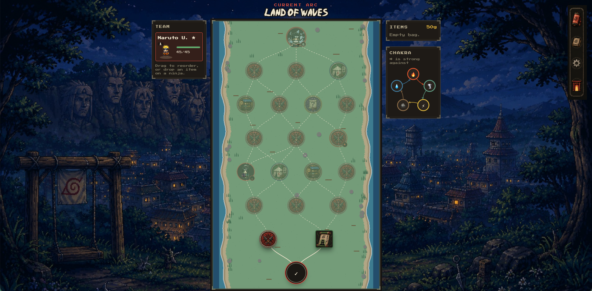
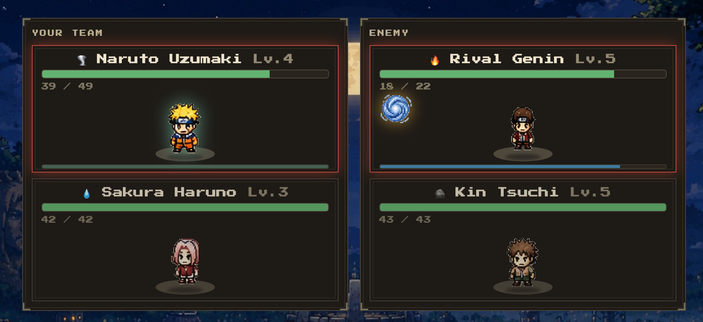
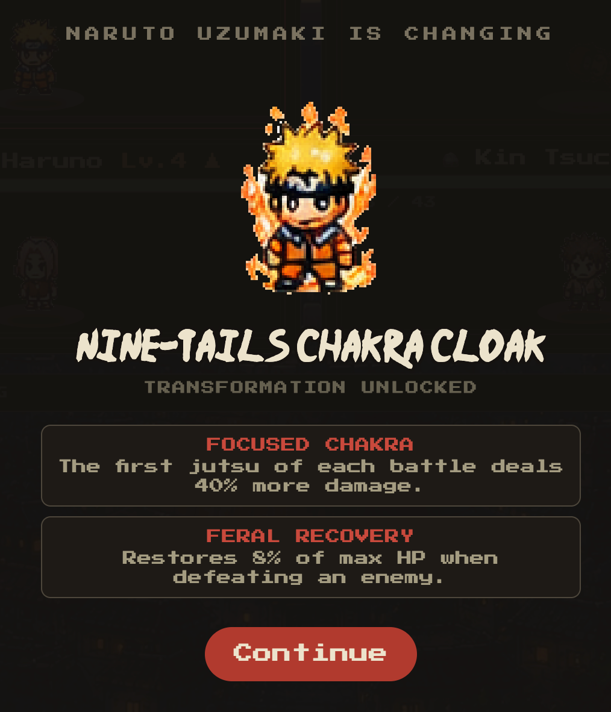
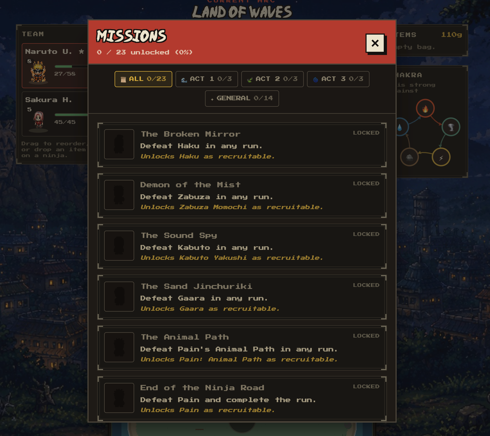

<div align="center">

# Narutolike

**Un roguelike de mapa ramificado en el mundo de Naruto.** Tres arcos en una sola partida, combate
automático, transformaciones y muerte permanente.

### ▶ [**Jugar en el navegador**](https://jmartinezmarquez.github.io/naruto-roguelike/)

*Sin instalar nada. La partida va por dentro del navegador.*

</div>



---

## Qué es

Eliges un ninja, subes por un mapa ramificado eligiendo por dónde pasas —combate, evento, tienda,
descanso, un pergamino de reclutamiento— y montas un equipo de tres. Al final de cada arco hay un jefe.
Si cae tu equipo entero, se acabó la partida: lo único que sobrevive de una run a otra es lo que has
desbloqueado.

Son **tres arcos encadenados** (País de las Olas → Examen Chunin → Invasión de Pain) del nivel 1 al ~51,
con Zabuza, Gaara y Pain al final de cada uno.

**El combate no se juega, se prepara.** No hay decisiones a mitad de la pelea: eliges *quién* va delante,
*qué* lleva equipado y *por dónde* pasas, y luego lo ves resolverse. Lo que decide una pelea son las
ventajas de naturaleza de chakra, el ritmo con el que cada ninja carga su jutsu y las pasivas que traen
sus objetos y sus transformaciones.

## Cómo se ve

| | |
|---|---|
|  | **El combate**, con los dos bandos en sendas cajas y la barra de carga del jutsu debajo de cada luchador. Si tu ninja cae, entra el siguiente contra el **mismo** enemigo, que conserva el daño recibido. |
|  | **Las transformaciones** se desbloquean subiendo de nivel y son una sorpresa: no se anuncian en ninguna ficha. No dan solo estadísticas, dan **pasivas** que cambian las reglas. |
|  | **La meta-progresión**: 23 logros que desbloquean ninjas reclutables, objetos de partida y personajes iniciales. Sobreviven a la derrota; la run, no. |

## Lo que tiene dentro

- **Mapa generado** por arco: forma de diamante, dos pisos seguidos nunca miden lo mismo, descanso
  garantizado antes del jefe y proporciones de nodo calibradas contra las de Slay the Spire.
- **Cinco naturalezas de chakra** con su tabla de ventajas, **31 transformaciones**, un catálogo de
  **pasivas con nombre** que comparten objetos y modos, y objetos que **no dan estadísticas**: dan reglas.
- **Reclutamiento** por pergamino, con un desafío legendario que es un combate contra un ninja de élite
  a nivel fijo — solo se une si le ganas.
- **Eventos** con su precio a la vista, incluidas las probabilidades: lo que se esconde es el resultado
  del dado, no las reglas.
- **Bingo Book** (enciclopedia) que solo enseña lo que ya has visto en juego, tema claro y oscuro,
  velocidad de animación y música por arco.

## Cómo está hecho

Este repositorio es también el experimento: **un mes de trabajo intermitente con [Claude
Code](https://claude.com/claude-code)**, empezando de cero el 6 de agosto de 2026.

| | |
|---|---|
| Días de trabajo | 11 |
| Commits | 56 |
| Código | ~9.700 líneas (+2.700 de datos JSON) |
| Tests | **275**, en `engine/` y `store/` |
| Documentos de diseño | **39** |
| Sprites | 106 |

Lo que hace distinto a este repositorio no es el código: es la carpeta **[`documentacion/`](documentacion/)**.
Son 39 documentos donde está escrito **por qué** cada cosa es como es — incluidas las decisiones que se
tomaron mal y se dieron la vuelta. El escalado dinámico de enemigos que se probó y se descartó; los
objetos que daban estadísticas y se diluían con el nivel; la función de normalización que no era
idempotente y hacía que **el simulador de balance midiera unos números y el juego corriera con otros**;
la pantalla de eventos que parecía el problema cuando el problema era el contenido.

El índice está en [`documentacion/00-indice.md`](documentacion/00-indice.md), y si solo se va a abrir uno,
que sea [`11-progresion-y-arcos.md`](documentacion/11-progresion-y-arcos.md), que es la historia completa
de cuatro rediseños del balance.

**El reparto del trabajo**, por si sirve a alguien que quiera intentar algo parecido: la dirección, el
criterio de diseño, el arte y el playtest son humanos; la implementación, los tests y la documentación
salen de la conversación. El balance se mide con un simulador determinista
([`scripts/simular-combates.mjs`](scripts/simular-combates.mjs)) que juega runs enteras, no a ojo.

## Correrlo en local

```bash
npm install
npm run dev      # desarrollo
npm test         # los 275 tests
npm run build    # build de producción
```

Node 22 o superior. No hay backend ni base de datos: la meta-progresión vive en `localStorage`.

**Stack**: React + Vite, Zustand para el estado, Tailwind CSS v4, Vitest. El motor (`src/engine/`) es
**lógica pura** — no importa React ni el store, y por eso se puede testear entero sin DOM y simular miles
de combates desde un script.

## Aviso

Proyecto de fan, sin ánimo de lucro y con fines de aprendizaje. **Naruto** es propiedad de Masashi
Kishimoto y Shueisha; este juego no está afiliado ni respaldado por ellos. El código es mío y lo demás
es de quien es.
